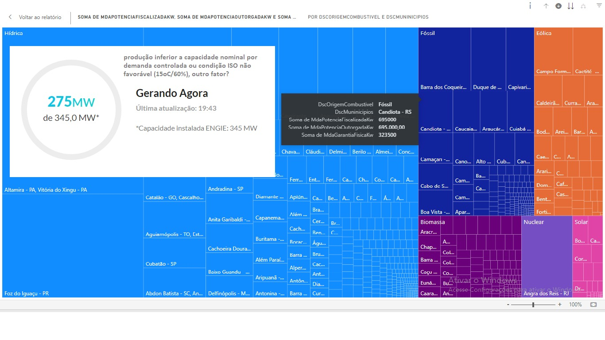
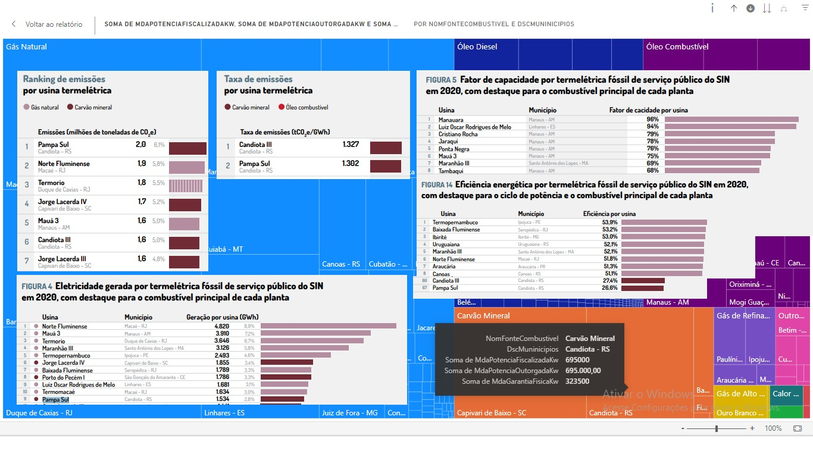

# DeepPampaSul

**Objetivos:**

1\. Reduzir os custos energéticos da usina termelétrica Pampa Sul em 20% ampliando a produção em 20%

2\. Melhorar a confiabilidade da planta em 10%.

3\. Reduzir as emissões de gases de efeito estufa da planta alinhado ao Acordo de Paris.

4\. Implementar as normas ISO 50001 by NBR compatíveis

O projeto DeepPampaSul será implementado em fases, seguindo uma metodologia adequada.

Em resumo, o projeto DeepPampaSul é importante para a usina termelétrica Pampa Sul, com potencial para gerar benefícios significativos. 

Com um planejamento sólido e uma equipe experiente, refinamos a eficiência energética da planta e reduzimos as emissões de gases de efeito estufa.

Além disso, o projeto DeepPampaSul está alinhado aos objetivos ESG e ODS 2030, sexta onda, ao ao reduzir as emissões de gases de efeito estufa, melhorar a eficiência energética e aumentar a confiabilidade, a usina termelétrica Pampa Sul se tornará mais sustentável e competitiva, apoiando na quinta onda, TIC.

Estamos confiantes de que o projeto DeepPampaSul será um sucesso e estamos animados para entregar os benefícios que ele trará para a usina termelétrica Pampa Sul, colaboradores, comunidades, arrecadação ao governo e ROI crescente aos investidores.

**Visão**

A visão da Pampa Sul é ser a usina de energia mais eficiente e sustentável do Brasil. A planta está comprometida em reduzir sua pegada de carbono e fornecer energia limpa e renovável para a comunidade.

**Missão**

A missão da Pampa Sul é fornecer energia confiável e acessível para a comunidade, enquanto protege o meio ambiente. A planta está comprometida em usar os melhores métodos e tecnologias para operar de forma eficiente e sustentável.

**Propósito**

O propósito da Pampa Sul é fornecer energia para a comunidade e proteger o meio ambiente. A planta está comprometida em usar suas habilidades e recursos para fazer a diferença no mundo.

**Valores**

A Pampa Sul está comprometida com os seguintes valores:

- Eficiência: A planta está comprometida em operar de forma eficiente e usar seus recursos de forma responsável.
- Sustentabilidade: A planta está comprometida em proteger o meio ambiente e reduzir sua pegada de carbono.
- Segurança: A planta está comprometida com a segurança de seus funcionários, visitantes e comunidade.
- Integridade: A planta está comprometida com a integridade e a honestidade em todas as suas atividades.
- Responsabilidade: A planta está comprometida com a responsabilidade social e ambiental.

**Cultura de manutenção**

A cultura de manutenção da Pampa Sul é baseada nos seguintes princípios:

- Prevenção: A planta está comprometida em prevenir falhas de equipamentos e manter sua confiabilidade.
- Otimização: A planta está comprometida em otimizar suas operações e melhorar sua eficiência.
- Segurança: A planta está comprometida com a segurança de seus funcionários e visitantes.
- Sustentabilidade: A planta está comprometida em reduzir seu impacto ambiental.
- Inovação: A planta está comprometida em inovar e adotar novas tecnologias para melhorar suas operações.

**O Ativo**

- A Usina Termelétrica Pampa Sul e a Usina Termelétrica Candiota são duas usinas de carvão localizadas no Rio Grande do Sul. 
- A Usina Termelétrica Pampa Sul está localizada no município de Candiota, a cerca de 150 quilômetros a oeste de Porto Alegre. A usina tem uma capacidade instalada de 345 megawatts (MW) e foi inaugurada em 2019. A usina utiliza carvão mineral da mina de Candiota
- *A Usina Termelétrica Candiota está localizada no mesmo município e tem uma capacidade instalada de 1.300 MW. A usina foi inaugurada em 1981 e é a maior usina termelétrica do Rio Grande do Sul. A usina utiliza carvão mineral da mina de Candiota, bem como carvão vegetal produzido na região. (A venda)*
- Ambas as usinas são fontes importantes de energia para o Rio Grande do Sul. A Usina Termelétrica Pampa Sul é uma usina relativamente nova e mais eficiente do que a Usina Termelétrica *Candiota. No entanto, a Usina Termelétrica Candiota ainda é uma usina importante e fornece energia para a região há mais de 40 anos.(A venda)*
- As duas usinas também são fonte de controvérsia. As usinas são criticadas por sua contribuição para as mudanças climáticas. Além disso, as usinas são criticadas por seu impacto ambiental, incluindo a poluição do ar e da água, um desafio e oportunidade.

A planta termelétrica Pampa Sul é uma usina de ciclo Rankine regenerativo que usa carvão como combustível. A planta tem uma capacidade de geração de 345 megawatts (MW) e está localizada em Candiota, Rio Grande do Sul, Brasil.

O processo de geração de energia na planta Pampa Sul começa com a combustão de carvão em uma caldeira. A combustão do carvão produz calor, que é usado para vaporizar água. O vapor superaquecido é então direcionado para uma turbina, que gira um gerador elétrico. O gerador elétrico produz eletricidade, que é então transmitida para a rede elétrica.

O calor residual do vapor é então recuperado em um regenerador de calor. O regenerador de calor usa o calor para vaporizar mais água, o que aumenta a eficiência da planta.

A água de alimentação da planta é tratada em uma planta de tratamento de água. A planta de tratamento de água remove impurezas da água, como partículas sólidas, sais e bactérias.

A cinza produzida pela combustão do carvão é armazenada em uma pilha de cinza. A pilha de cinza é monitorada para garantir que não haja riscos ambientais.

A planta Pampa Sul é uma usina eficiente e ambientalmente responsável. A planta está em conformidade com todos os regulamentos ambientais e está comprometida com a redução de suas emissões.

- A usina termelétrica Pampa Sul é uma usina de energia a carvão localizada no município de Candiota, Rio Grande do Sul, Brasil.
- A usina é operada pelos times táticos e operacionais Perfin Space X Grafito Fund.
- A usina tem uma capacidade instalada de 345 megawatts (MW).
- A usina é abastecida com carvão da mina de carvão Rio Grande, que fica a cerca de 4,4 quilômetros da usina.
- A usina usa água do rio Jaguarão para resfriar os geradores.
- A usina gera eletricidade através de uma turbina a vapor.
- A usina tem uma linha de transmissão de 20,4 quilômetros que a conecta à rede elétrica nacional.
- A usina tem um contrato de exclusividade com a Votorantim para a aquisição de cinzas.
- A usina recebe calcário da Votorantim e do pólo Intercement.
- A tecnologia de caldeira de leito fluidizado circulante (CFB) é uma tecnologia consolidada em usinas elétricas movidas a combustível sólido devido à sua alta eficiência no controle da poluição no processo de combustão.
- As unidades CFB usam um material de leito (como cinza) para apoiar a queima de combustíveis sólidos para gerar calor. O vapor gerado dentro da caldeira é então usado para geração de energia nas turbinas.
- As principais vantagens da tecnologia CFB, em comparação com a combustão de carvão pulverizado, incluem:
  - Controle de emissões: o leito de calcário captura e remove o SO2. A baixa temperatura de combustão do CFB também minimiza a formação de Nox.
  - Alimentação simplificada sem beneficiamento adicional de combustível.
  - O CFB reduz os equipamentos que as usinas de carvão convencionais precisam para capturar SO2 e NOx.

**Fluxograma ilustrativo do processo CFB:**

O processo CFB começa com a alimentação de carvão e calcário em uma câmara de combustão. O carvão é então queimado no ar, gerando calor. O calor é então usado para vaporizar a água em um tambor de vapor. O vapor é então usado para girar uma turbina, que gera eletricidade. O gás de combustão é então descarregado na atmosfera, após ser limpo de poluentes.

A tecnologia CFB é uma tecnologia eficiente e limpa que pode ajudar a reduzir as emissões de poluentes das usinas de energia a carvão.

**Balanço térmico**

A entrada de energia na planta Pampa Sul é o calor produzido pela combustão do carvão. A saída de energia da planta é a eletricidade produzida pelo gerador elétrico. O calor residual do vapor é recuperado no regenerador de calor.

O balanço térmico da planta Pampa Sul é o seguinte:

Eficiência Energética:  26,6%

Entrada de energia: 345 MW 

Saída de energia: 345 MW 

Calor residual: 73,4%, **256,64 MW. (sprint 3)**

**Balanço químico**

A entrada de material na planta Pampa Sul é o carvão. A saída de material da planta é a eletricidade e as cinzas.

O balanço químico da planta Pampa Sul é o seguinte:

Entrada de material: 1.000 toneladas métricas por dia Saída de material: 345 MW de eletricidade + 200 toneladas métricas por dia de cinzas

A planta Pampa Sul é uma usina eficiente e ambientalmente responsável. A planta está em conformidade com todos os regulamentos ambientais e está comprometida com a redução de suas emissões.

**DeepTreemap** (cotesia mncwl machine no carbon no  water no losses, subsidiária ecohold)

**Controladores & Mercado**

|**Oportunidade**|**Fundadores**|**CEO**|**Conselho**|**Ativos**|**ROI**|
| :- | :- | :- | :- | :- | :- |
|Perfin Space X||||US$1 bilhão|15%|
|Grafito||||US$500 milhões|12%|
|Libor Europa x Inflação|||||(-)3%|
|Libor USD x Inflação|||||(-)3%|
|NTN|||||Selic + Prêmio|
|DeepPampaSul|||||20%|
|Valuation Pampa Sul|||||20%|
|Receitas Pampa Sul|||||20%|

|**Sprints**||
| :-: | :- |
|**Sprint 0**|

**Levantamento de requisitos**

Empresas: Pampa Sul (empresa adquirida), Siemens (fabricante da turbina).

&emsp;&emsp;Departamentos: Manutenção, Gerência Técnica de Grandes Paradas.

&emsp;&emsp;Responsáveis: Paulo Santos (Gerente da Usina), Lopes (Gerente Técnico de Grandes Paradas).

&emsp;&emsp;Entregas: Realizar o raio X da manutenção atual, definir planos de manutenção para equipamentos A, B e C, propor melhorias na confiabilidade e distribuição do time de manutenção.

&emsp;&emsp;KPIs: Criticidade ABC dos equipamentos, confiabilidade dos ativos, distribuição da equipe de manutenção.

&emsp;&emsp;Variáveis: Tipo de combustível (carvão), capacidade da caldeira (1.016 toneladas/hora), pressão (160-150 kg), potência da turbina (345 MW), tratamento de água, logística de insumos e resíduos.

&emsp;&emsp;Parâmetros: Eficiência operacional, segurança, confiabilidade, qualidade da manutenção.

&emsp;**Dores e Demandas:**

&emsp;&emsp;Necessidade de identificar planos de manutenção para equipamentos A, B e C.

&emsp;&emsp;Busca por melhorias na confiabilidade dos ativos e na distribuição do time de manutenção.

&emsp;&emsp;Urgência em tratar as questões de manutenção o mais rápido possível.

&emsp;**Recursos Necessários:**

&emsp;&emsp;Pessoas: Consultor especializado em manutenção (Eco Hold ou Zeh Sobrinho), gerente técnico de grandes paradas (Lopes).

&emsp;&emsp;Perfil: Experiência prévia em manutenção industrial, conhecimento de boas práticas de manutenção e gestão de ativos.

&emsp;&emsp;Formação: Engenharia ou área relacionada.

&emsp;&emsp;Experiência: Experiência em manutenção de plantas termelétricas, conhecimento de equipamentos de geração de energia a carvão.

&emsp;&emsp;Certificação: Certificações em gestão de ativos ou manutenção (opcional).

&emsp;&emsp;Capex: Recursos financeiros para investimentos em melhorias de manutenção.

&emsp;**Plano de Trabalho e Responsáveis:**

&emsp;&emsp;Fase 1: Realizar o raio X da manutenção atual (Responsável: Consultor especializado em manutenção).

&emsp;&emsp;Fase 2: Definir planos de manutenção para equipamentos A, B e C (Responsáveis: Consultor especializado em manutenção, Gerente Técnico de Grandes Paradas).

&emsp;&emsp;Fase 3: Propor melhorias na confiabilidade e distribuição do time de manutenção (Responsáveis: Consultor especializado em manutenção, Gerente Técnico de Grandes Paradas).

&emsp;**Capex, Opex, Receitas, ROI:**

&emsp;&emsp;Capex: Recursos financeiros necessários para investimentos em melhorias de manutenção.

&emsp;&emsp;Opex: Custos operacionais relacionados à manutenção, incluindo despesas com mão de obra, peças de reposição, serviços contratados, entre outros.

&emsp;&emsp;Receitas: Fluxo de receita gerado pela usina termoelétrica por meio da produção e venda de energia.

&emsp;&emsp;ROI (Retorno sobre o Investimento): Indicador que avalia a eficiência do investimento realizado nas melhorias de manutenção em relação ao retorno financeiro obtido.

&emsp;**Nome do Projeto, Fases, Duração, Qualificação, Certificação, Validação:**

&emsp;&emsp;Nome do Projeto: "Melhoria da Manutenção da Termelétrica Pampa Sul"

&emsp;&emsp;Fases: Raio X da Manutenção Atual, Definição de Planos de Manutenção, Proposta de Melhorias na Confiabilidade e Distribuição do Time de Manutenção.

&emsp;&emsp;Duração: A ser definida com base na complexidade das tarefas e recursos disponíveis.

&emsp;&emsp;Qualificação: Profissionais com experiência em manutenção industrial e conhecimentos específicos em termelétricas a carvão.

&emsp;&emsp;Certificação: Certificações em gestão de ativos ou manutenção podem ser consideradas.

&emsp;&emsp;Validação: As propostas de melhoria serão validadas pelo gerente da usina e pelos departamentos envolvidos antes da implementação.

&emsp;**Sugestão:**

&emsp;&emsp;Sugere-se marcar uma reunião para discutir as necessidades e expectativas da Termelétrica Pampa Sul, com a presença do gerente da usina (Paulo Santos), do gerente técnico de grandes paradas (Lopes) e do consultor especializado (Eco Hold ou Zeh Sobrinho). Essa reunião permitirá um maior entendimento do projeto e a elaboração de um plano de trabalho mais detalhado e alinhado às demandas específicas da usina.

|
|**Sprint 1**|
**Plano de Ação Integrado por Fases:**

**Fase 1: Diagnóstico Inicial e Curva ABC (demanda 1)**

1\. Realizar visitas à planta para análise da situação atual.

1\.1 Nota importante. O trabalho se inicia na definição dos parâmetros de projeto ISO, capacidade nominal

2\. Coletar dados sobre os equipamentos, processos e planos de manutenção existentes.

3\. Classificar os equipamentos em A, B e C com base em sua criticidade.

**Fase 2: Análise de Planos de Manutenção e Definição de Indicadores**

1\. Avaliar os planos de manutenção existentes.

2\. Identificar lacunas e propor melhorias nos planos atuais.

3\. Desenvolver novos planos para os equipamentos de maior criticidade.

4\. Estabelecer indicadores de desempenho para monitorar a eficácia dos planos de manutenção.

5\. Definir metas e valores de referência para cada indicador.

**F**ase 3: Revisão de Estratégias de Manutenção e Implementação do Sistema de Gestão de Energia

1\. Analisar as estratégias de manutenção adotadas atualmente.

2\. Propor ajustes e melhorias nas estratégias, visando aumentar a confiabilidade da planta.

3\. Avaliar a viabilidade e benefícios da implementação da norma ISO 50001.

4\. Desenvolver um plano de ação para obter a certificação ISO 50001.

5\. Estabelecer metas e indicadores relacionados à eficiência energética.

**F**ase 4: Monitoramento e Análise

1\. Estabelecer um sistema de monitoramento do balanço energético da usina.

2\. Analisar os resultados do balanço energético e identificar possíveis oportunidades de melhoria.

3\. Implementar um sistema de monitoramento do balanço químico da planta.

4\. Estabelecer parâmetros e limites operacionais para cada componente químico relevante.

5\. Realizar avaliações da qualidade do ar interior na usina.

**Fase 5: Elaboração de Propostas e Implementação das Melhorias**

1\. Desenvolver propostas para melhorar a eficiência energética da planta.

2\. Identificar oportunidades de otimização de processos e sistemas.

3\. Apoiar a equipe da Pampa Sul na implementação das recomendações propostas.

4\. Realizar treinamentos e capacitações para a equipe de manutenção e operação da planta.

**Fase 6: Monitoramento, Acompanhamento e Contrato SLA**

1\. Acompanhar o desempenho dos indicadores ao longo do tempo.

2\. Realizar revisões periódicas para garantir a eficácia das melhorias implementadas.

3\. Elaborar um contrato SLA para estabelecer os níveis de serviço e responsabilidades.

4\. Definir indicadores de desempenho e metas a serem alcançadas.

5\. Estabelecer as condições contratuais e acordos de prestação de serviços.

Ao seguir esse plano de ação integrado por fases, será possível abordar os principais objetivos de balanço energético, balanço químico, qualidade do ar interior, eficiência energética, ISO 50001, redução de emissões e incremento de receitas. Cada fase contribuirá para a melhoria contínua da gestão da manutenção e operação da Usina Pampa Sul.

|
|** |
**Apêndice**

- Apêndice A: Lista de variáveis operacionais

- Apêndice B: Modelo de aprendizado de máquina

- Apêndice C: Plano de implementação

- Apêndice D: Plano de testes

- Apêndice E: Plano de implantação

**Apêndice A: Lista de variáveis operacionais**

- Temperaturas

- Vazões

- Vazamentos

- Insumos

- Resíduos

- Eficiência energética

- Capex

- Opex

- Receitas

- Valuation

- Vibrações

- IAQ Index Rating interno e externo (raio de 20 km)

- Qualidade da água de alimentação

- Qualidade das cinzas

- Emissões de gases poluentes

- Nível de ruído

- Segurança dos funcionários

- Segurança do meio ambiente

- Custos de manutenção

- Custos de operação

- Custos de produção

- Lucratividade

- Competitividade

- Outras

**Apêndice B: Modelo de aprendizado de máquina (apêndice vira Sprint)**

O modelo de aprendizado de máquina que será usado no DeepPampaSul será um modelo de regressão. O modelo será treinado em um conjunto de dados de histórico de operação da planta. O conjunto de dados incluirá dados de temperaturas, vazamentos, vazamentos, insumos, resíduos e eficiência energética. O modelo será usado para prever as temperaturas, vazamentos, vazamentos, insumos, resíduos e eficiência energética da planta.

O modelo de aprendizado de máquina será implementado em um servidor REST. O servidor REST fornecerá acesso aos dados do modelo para usuários autorizados. Os usuários autorizados poderão usar os dados do modelo para gerar relatórios, visualizar dados e fazer análises.

O modelo de aprendizado de máquina será gerenciado por uma equipe de especialistas em aprendizado de máquina. A equipe de especialistas será responsável por treinar o modelo, testar o modelo e implantar o modelo. A equipe de especialistas também será responsável por monitorar o modelo e fazer ajustes no modelo conforme necessário.

**Apêndice C: Plano de implementação**

O plano de implementação do DeepPampaSul será dividido em três fases:

- Fase 1: Coleta de dados. Nesta fase, os dados históricos de operação da planta serão coletados. Esses dados serão usados para treinar o sistema de aprendizado de máquina.

- Fase 2: Desenvolvimento do sistema. Nesta fase, o sistema de aprendizado de máquina será desenvolvido. O sistema será treinado nos dados históricos de operação da planta e será testado em dados em tempo real.

- Fase 3: Implementação do sistema. Nesta fase, o sistema de aprendizado de máquina será implementado na planta. O sistema será integrado ao sistema de controle da planta e será usado para monitorar a planta e identificar possíveis problemas.

**Apêndice D: Plano de testes**

O plano de testes do DeepPampaSul será dividido em dois estágios:

- Estágio 1: Testes de unidade. Nesta fase, os componentes individuais do sistema de aprendizado de máquina serão testados individualmente.

- Estágio 2: Testes de integração. Nesta fase, os componentes individuais do sistema de aprendizado de máquina serão testados em conjunto.

|
|**Sprint 2**|
**DeepCool** 

A planta Pampa Sul é uma usina de energia a carvão localizada no município de Candiota, Rio Grande do Sul, Brasil. A planta foi construída em 1980 e tem uma capacidade instalada de 345 megawatts (MW). A planta foi recém adquirida da ENGIE Brasil pelos investidores institucionais Perfin Space X Grafito

A planta Pampa Sul é uma planta Rankine regenerativa, o que significa que usa o calor do vapor para gerar eletricidade. A água é aquecida em uma caldeira e depois transformada em vapor. O vapor é então usado para girar uma turbina, que gera eletricidade. O calor residual do vapor é então usado para aquecer água, que é usada para gerar vapor novamente.

A planta Pampa Sul usa uma caldeira de leito fluidizado de 1.160 toneladas por hora (TPH). A caldeira é fabricada pela Siemens e tem uma pressão de operação de 160 bar. A planta também usa uma turbina Siemens de 345 MW.

A planta Pampa Sul tem uma ETA (unidade de tratamento de água) da Veolia Suez. A ETA tem uma capacidade de 15 milhões de metros cúbicos por dia (m³/d) e usa um processo de osmose reversa para tratar a água.

A planta Pampa Sul tem uma eficiência de 26,6%. A planta recupera o calor residual do vapor para alimentar chillers por absorção Broad. A planta tem 12 chillers Broad, cada um com uma capacidade de 10 MW. A planta também tem um sistema de recuperação de calor de 30 MW.

Projeto de Retrofit

O projeto de retrofit da planta Pampa Sul prevê a instalação de chillers por absorção Broad para recuperar o calor residual do vapor. Os chillers Broad são alimentados pelo calor residual do vapor da turbina.

O projeto de retrofit prevê a instalação de 12 chillers Broad, cada um com uma capacidade de 2,5 MW. Os chillers Broad são modelos Broad 2000.

O total de frio produzido pelos chillers Broad é de 30 MW. Isso equivale a 30.000 TR/h.

O total de frio produzido pelos chillers Broad será usado para refrigerar os servidores do DeepCloud.

Os servidores e sistemas de energia do DeepCloud consomem 90 MW de energia. Isso equivale a 90.000 TR/h.

O DeepCloud da planta Pampa Sul será dedicado ao processamento de inteligência artificial para o Google.

A planta Pampa Sul gerará R$ 100 milhões em receita extra com o DeepCloud.

O contrato entre a planta Pampa Sul e o Google Cloud é um contrato de 5 anos. O contrato prevê que a planta Pampa Sul fornecerá 100 MW de energia para o DeepCloud do Google. O Google pagará à planta Pampa Sul R$ 20 milhões por ano pelo fornecimento de energia.

A Ecohold ganhará 10% do contrato SLA com a planta Pampa Sul. A Ecohold também ganhará 5% em ações da Perfin Space X e Grafito.

O Capex total do projeto de retrofit é de R$ 200 milhões. O Capex inclui o custo dos chillers, o custo da engenharia e o custo do DeepCloud. O Opex total do projeto é de R$ 100 milhões. O Opex inclui o custo de energia, o custo de manutenção e o custo de operação do DeepCloud. As receitas totais do projeto são de R$ 300 milhões. Os lucros totais do projeto são de R$ 100 milhões. O ROI do projeto é de 50%.

Conclusão

O projeto de retrofit da planta Pampa Sul é uma iniciativa lucrativa que gerará receita extra para a planta e para a Ecohold. O projeto também ajudará a planta a reduzir suas emissões de carbono.

Plano de ação

O projeto de retrofit da planta Pampa Sul será realizado em três fases:

- Fase 1: Instalação dos chillers por absorção Broad.

- Fase 2: Construção do DeepCloud.

- Fase 3: Comissionamento do DeepCloud.

A empresa de engenharia responsável pelo projeto será a Siemens. O tempo estimado para o projeto é de 18 meses.

Tarefas

As tarefas a serem realizadas no projeto de retrofit da planta Pampa Sul são as seguintes:

- Instalação dos chillers por absorção Broad.

- Construção do DeepCloud.

- Comissionamento do DeepCloud.

As tarefas serão realizadas pela empresa de engenharia Siemens. O tempo estimado para o projeto é de 18 meses.

|
|**Sprint 3**|
**Plano de ação inicial. Levantar projeto original da planta, capacidades nominais (condição ISO)**   Analisando uma caldeira padrão Caldeira

- Tipo: Leito fluidizado

- Pressão: 160 bar

- Temperatura: 900 °C

- Capacidade: 1.160 toneladas/hora

- Eficiência: 85%

Turbina a vapor

- Modelo: Siemens SGT-800

- Capacidade: 345 MW

- Eficiência: 42% contra 26,8% de PampaSul 

Condição isobárica

A condição isobárica é uma condição em que a pressão permanece constante. Em uma usina termelétrica a carvão, a condição isobárica é alcançada através do uso de um compressor de vapor. O compressor de vapor aumenta a pressão do vapor, o que aumenta sua temperatura e sua energia. O vapor quente e pressurizado é então usado para girar uma turbina, que gera eletricidade.

A eficiência de uma usina termelétrica a carvão é medida como a proporção da energia do combustível que é convertida em energia elétrica. A eficiência de uma usina termelétrica a carvão pode variar de 30% a 45%, dependendo do tipo de usina e da tecnologia utilizada.

**No Sprint 3 identificamos diferença significativa de eficiência energética de uma usina padrão e Pampa Sul, daí a necessidade do primeiro plano de ação não ser em campo, mas preparo do checklist para o campo com base na análise prévia do projeto junto ao projetista, fabricante, montador para localizar e planejar os planos de manutenção originais, uma vez que a missão da engenharia de manutenção é preservar e manter a performance e opex de projeto (% do faturamento setorial ou abaixo - Abraman, local)**  Para identificar o plano de manutenção original de cada componente por segmento na usina Pampa Sul, é necessário realizar uma análise detalhada de cada área dos projetos originais com base em algumas sugestões de possíveis componentes e suas respectivas abordagens de manutenção a ser refinado e customizado:

1\. Automação e Controle:

`   `- PLCs (Controladores Lógicos Programáveis): A manutenção pode incluir verificação periódica de entradas e saídas, calibração de sensores, revisão do software e atualizações de firmware. A periodicidade dependerá da criticidade do sistema e do histórico de falhas.

`   `- Sistemas de Supervisão e Aquisição de Dados (SCADA): Manutenção inclui verificação do funcionamento dos equipamentos de comunicação, atualização do software, revisão dos alarmes e ajustes de parâmetros. A periodicidade pode ser mensal ou trimestral.

2\. Elétrica e Subgrupos:

`   `- Paineis Elétricos: Manutenção inclui inspeção visual, verificação de conexões, limpeza e aperto de terminais, medição de corrente e tensão, e teste de proteções. A periodicidade pode variar entre semanal e anual, dependendo da criticidade dos equipamentos.

`   `- Transformadores: Manutenção inclui inspeção, limpeza, medição de resistência de isolamento, teste de óleo isolante, termovisão e análise de gases dissolvidos. A periodicidade pode ser anual ou conforme recomendações do fabricante.

3\. Motores:

`   `- Motores Elétricos: Manutenção pode incluir lubrificação, limpeza, inspeção de escovas (se aplicável), medição de corrente e tensão, teste de isolamento e alinhamento. A periodicidade depende do tipo de motor, carga e ambiente, podendo variar de mensal a semestral.

4\. Trocadores de Calor:

`   `- Limpeza: A manutenção inclui limpeza dos tubos e aletas, remoção de incrustações e depósitos. A periodicidade pode ser definida com base na redução de desempenho do trocador ou a cada 1 a 2 anos, dependendo da aplicação e qualidade do fluido.

`   `- Inspeção de Vazamentos: Verificação visual e teste de pressão para detectar vazamentos nos tubos e juntas. A periodicidade pode ser anual ou conforme recomendações do fabricante.

5\. Turbinas:

`   `- Manutenção Preventiva: Inclui inspeção visual, medição de vibração, verificação de temperatura, análise de óleo lubrificante, limpeza e ajustes. A periodicidade pode variar de acordo com o tipo de turbina e as recomendações do fabricante.

6\. Caldeiras:

`   `- Limpeza: Manutenção inclui remoção de incrustações, limpeza dos tubos, inspeção visual, verificação de vazamentos e teste de pressão. A periodicidade pode ser definida com base na redução de desempenho da caldeira ou a cada 1 a 2 anos, dependendo da aplicação e qualidade do combustível.

7\. Estação de Tratamento de Água:

`   `- Manutenção dos sistemas de filtragem: Verificação e limpeza dos filtros, substituição de elementos filtrantes, monitoramento da qualidade da água tratada. A periodicidade pode variar dependendo do tipo de filtro e da qualidade da água de entrada.

`   `- Manutenção dos sistemas de dosagem de produtos químicos: Verificação dos equipamentos, substituição de componentes, calibração dos dosadores. A periodicidade dependerá do tipo de produto químico e dosagem utilizada.

8\. Logística de Insumos:

`   `- Manutenção dos sistemas de transporte de insumos: Verificação dos equipamentos, limpeza, lubrificação, substituição de componentes desgastados. A periodicidade dependerá da intensidade de uso e das condições operacionais.

9\. Logística de Resíduos Sólidos:

`   `- Manutenção dos equipamentos de coleta e armazenamento: Verificação dos recipientes, limpeza, substituição de componentes danificados, garantia de vedação adequada. A periodicidade dependerá do volume de resíduos gerados e das condições de armazenamento.

10\. Logística de Resíduos Gasosos:

`    `- Manutenção dos sistemas de controle de emissões: Verificação dos equipamentos de filtragem, limpeza ou substituição dos filtros, calibração de sensores. A periodicidade dependerá da natureza e quantidade de resíduos gasosos gerados.

11\. Grandes Paradas:

`    `- Planejamento detalhado das paradas, incluindo definição de escopo, alocação de recursos, cronograma, atividades de manutenção preventiva e corretiva. A periodicidade dependerá do ciclo de operação da usina e das necessidades de manutenção.

12\. Subestações:

`    `- Manutenção dos equipamentos de alta tensão: Verificação das conexões, limpeza, medição de corrente e tensão, teste de proteções, análise de óleo isolante. A periodicidade pode variar entre anual e bienal, dependendo das recomendações do fabricante e da criticidade dos equipamentos.

Essas são apenas sugestões de componentes e atividades de manutenção. Cada usina pode ter especificidades e equipamentos diferentes, portanto, é necessário adaptar o plano de manutenção de acordo com as características específicas da usina Pampa Sul.

Quanto aos planos operacionais padrão, é importante elaborar procedimentos detalhados para cada área, especificando as tarefas, a periodicidade, a duração estimada, a equipe necessária, o perfil e formação dos profissionais envolvidos, os indicadores de desempenho (KPIs) e as variáveis de monitoramento para assegurar a manutenção dos valores de projeto. Além disso, é fundamental realizar uma análise da qualidade do ar interno e externo, para garantir um ambiente de trabalho saudável e em conformidade com as regulamentações ambientais.

A saída esperada será a possibilidade de identificar e implementar retrofits e upgrades que ampliem a produção de energia, reduzam as emissões, aumentem a segurança operacional e a disponibilidade dos ativos, com o objetivo de alcançar uma taxa de parada não programada próxima de zero.

|
|**Sprint 4**||
|**Sprint 5**||
|**Bibliography:**|
1. EIA Rima PampaSul <https://audienciaspublicas.org/wp-content/uploads/2021/05/Volume-6B-Cap-16-Anexos.pdf>

2. Teia/Adesampa Course: Trends in sustainable fashion business, attended in February 2023 by Zeh Sobrinho,<https://drive.google.com/file/d/1KBz-irYciXUYgo6Blpl36B8uY6zt03jf/view?usp=sharing>

3. Making Money from Trash: Five Steps: Zeh Sobrinho ,<https://m.youtube.com/watch?v=SqjE8FG06W0>

4. Homeless population exceeds 281,400 people in Brazil. Retrieved on 03/29/2023 [https://cutt](https://cutt.ly/K4V2Dxu)[.ly/K4V2Dxu](https://cutt.ly/K4V2Dxu)

5. Pink Sheet OTC Market IPO (Annual Cost) https://www.otcmarkets.com/
|

|**Investor Type**|**Investor**|**Investment Amount (USD)**|**Investment Amount (PLIMM paired with Ethereum)**|**Eco-hold Portal Opportunity investment**|
| :- | :- | :- | :- | :- |
|Seed|Angel Investor|$50,000|10 ETH/PLIMM|USA&CCNFT | Popmedia|
|Seed|Venture Capital Firm|$500,000|100 ETH/PLIMM|USA&CCNFT | Popmedia|
|Seed|Accelerator Program|$100,000|20 ETH/PLIMM|USA&CCNFT | Popmedia|
|Series A|Private Equity Firm|$2,000,000|400 ETH/PLIMM|USA&CCNFT | Popmedia|
|Series A|Corporate Venture Capital|$1,000,000|200 ETH/PLIMM|USA&CCNFT | Popmedia|
|Series B|Growth Equity Firm|$5,000,000|1,000 ETH/PLIMM|USA&CCNFT | Popmedia|
|Series C|Pension Fund|$10,000,000|2,000 ETH/PLIMM|Upcycled Africa Fashion & CCNFT's:|
|Friends and Family|Friends and Family|$100,000|20 ETH/PLIMM|USA&CCNFT | Popmedia|
|Pension Funds|Late stage|$100,000,000|52,694.45 ETH/PLIMM|PLIMM 2 | Poplixo city NFT´s|
|
Investor Relations: As of April 2022, 1% of Eco-Hold is equivalent to US$20,000,000 or 10915.12 PLIMM/ETH.

The acquisition of USA&CCNFT, UAF&CCNFT, UE&CCNFT, NFT or cryptocurrency PLIMM from opensea platform - Eco-Hold, an pinkshet OTC Market are the Portal Opportunity Investment Convertibles into Eco-Hold Shares Poplixo Investment Ecosistem, 100% automated process.

Relações com investidores: A partir de abril de 2022, 1% do Eco-Hold equivale a US$ 20.000.000 ou 10.915,12 PLIMM/ETH.

A aquisição da USA&CCNFT, UAF&CCNFT, UE&CCNFT, NFT ou cripto moeda PLIMM da plataforma opensea - Eco-Hold, um mercado OTC pinkshet são o Portal Opportunity Investment Convertibles into Eco-Hold Shares Poplixo Investment Ecosistem, processo 100% simplificado.

Связи с инвесторами: по состоянию на апрель 2022 года 1% Eco-Hold эквивалентен 20 000 000 долларов США или 10 915,12 PLIMM/ETH.

Приобретение USA&CCNFT, UAF&CCNFT, UE&CCNFT, NFT или криптовалюты PLIMM от платформы OpenSea – Eco-Hold, внебиржевого рынка Pinkshet, представляет собой конвертируемые инвестиционные активы Portal Opportunity в акции Eco-Hold Poplixo Investment Ecosistem, процесс на 100 % автоматизирован.

 投資者關係：截至 2022 年 4 月，Eco-Hold 的 1% 相當於 20,000,000 美元或 10915.12 PLIMM/ETH。

從 opensea plataforma 收購 USA&CCNFT、UAF&CCNFT、UE&CCNFT、NFT 或 cripto moeda PLIMM - Eco-Hold，一個 pinkshet 場外交易市場是門戶機會投資可轉換為 Eco-Hold 股份 Poplixo Investment Ecosistem，processo 100% automizado。

علاقات المستثمرين: اعتبارًا من أبريل 2022 ، 1٪ من Eco-Hold يساوي 20،000،000 دولار أمريكي أو 10915.12 PLIMM / ETH.

إن الاستحواذ على USA & CCNFT و UAF & CCNFT و UE & CCNFT و NFT أو cripto moeda PLIMM من openea plataforma - Eco-Hold و pinkshet OTC Market هي فرص الاستثمار القابلة للتحويل في أسهم Eco-Hold Poplixo Investment Ecosystem ، معالجة تلقائية بنسبة 100٪.

निवेशक संबंध: अप्रैल 2022 तक, इको-होल्ड का 1% US$20,000,000 या 10915.12 PLIMM/ETH के बराबर है।

Opensea Plataforma से USA&CCNFT, UAF&CCNFT, UE&CCNFT, NFT या क्रिप्टो मोएडा पीएलआईएमएम का अधिग्रहण - इको-होल्ड, एक पिंकशीट ओटीसी मार्केट ईको-होल्ड शेयरों में पोर्टल अवसर निवेश परिवर्तनीय हैं, 100% स्वचालित प्रक्रिया।
|||||

||

6. PLIMM 0 - Hackathon Elo APICON 2020 <https://docs.google.com/spreadsheets/d/e/2PACX-1vTeXaGak0BMvC8vLzojWg4kX_pPUTkW_Xp3I8X__YAGdVbtgdDLktw_sI2Mukd3Hw/pubhtml#>

7. PLIMM 1 - cryptocurrency and NFTpoplix, within the scope of Bacen, Retrieved on March 29, 2023, from<https://github.com/bacen/pix-api/discussions/255>

8. PLIMM 2 - junk pop NFT cryptocurrency, within the framework of opensea,<https://opensea.io/collection/plimm>

9. Duli - Universal Injury Detector[ https://devpost.com/software/covid-19-detect-ii](https://devpost.com/software/covid-19-detect-ii)

10. Law provides for guidelines to be observed in the provision of virtual asset services and in the regulation of virtual asset service providers. Retrieved March 29, 2023 from<https://www2.camara.leg.br/legin/fed/lei/2022/lei-14478-21-dezembro-2022-793516-norma-pl.html>

11. Upcycled Africa Fashion &CCNFT's: accessed 29 March 2023 from [https://opensea.io/assets?search\[query\]=poplixo](https://opensea.io/assets?search%5Bquery%5D=poplixo)

12. GARTNET. Gartner Identifies Key Emerging Technologies Spurring Innovation Through Trust, Growth and Change. 2021.Disponível em: <https://www.gartner.com/en/newsroom/press-releases/2021-08-23-gartner-identifies-key-emerging-technologies-spurring-innovation-through-trust-growth-and-change>. Accessed on: August 05, 2022.

13. WIRED. Crypto Rebels. 1993. Available at: <https://www.wired.com/1993/02/crypto-rebels>. Accessed on: August 05, 2022.

14. HABER, S.; STORNETTA, W. S. How to time-stamp a digital document, Journal of Cryptography, Vol. 3, No. 2, pp. 99–111. 1991. Disponível em: <https://link.springer.com/content/pdf/10.1007/BF00196791.pdf>. Accessed on: August 05, 2022.

15. DWORK, C.; NAOR, M. Pricing via processing or combatting junk mail. Advances in Cryptology: CRYPTO 1992. Annual International Cryptography Conference. 1992. Disponível em: <https://link.springer.com/content/pdf/10.1007/3-540-48071-4_10.pdf>. Accessed on: August 05, 2022.

16. NAKAMOTO, S. Bitcoin: a peer-to-peer electronic cash system. 2008. Available at: <https://bitcoin.org/bitcoin.pdf>. Accessed on: August 05, 2022.

17. THE ECONOMIST. The trust machine. 2015. Available at: <https://www.economist.com/leaders/2015/10/31/the-trust-machine>. Accessed on: August 05, 2022.

18. BLOOMBERG. Blythe Masters Tells Banks the Blockchain Changes Everything. 2015. Disponível em: <https://www.bloomberg.com/news/features/2015-09-01/blythe-masters-tells-banks-the-blockchain-changes-everything>. Accessed on: August 05, 2022.

19. CATALINI, C.; JOSHUA, S. G. Some simple economics of the blockchain. Communications of the ACM 63, 7. 2020. Disponível em: <https://cacm.acm.org/magazines/2020/7/245703-some-simple-economics-of-the-blockchain/fulltext>. Accessed on: August 05, 2022.

20. BANCO CENTRAL DO BRASIL. Distributed ledger technical research 
in Central Bank of Brazil. 2017. Disponível em: <https://www.bcb.gov.br/htms/public/microcredito/Distributed_ledger_technical_research_in_Central_Bank_of_Brazil.pdf>. Accessed on: August 05, 2022.

21. Inside Job, <https://www.youtube.com/watch?v=FhfvtOSd5fU>

22. IEA Sankey Power Losses US$17 trillions year, <https://www.iea.org/sankey/>

23. Popmedia, https://opensea.io/collection/popmedia

24. LIVECOINS. Coordinator of the Central Bank of Brazil says that Bitcoin is a financial innovation. 2022. Available at:<https://livecoins-com-br.cdn.ampproject.org/c/s/livecoins.com.br/diretor-do-banco-central-do-brasil-diz-que-bitcoin-e-uma-inovacao-financeira/amp/>. Accessed on: August 05, 2022.

25. BNDES.BNDESToken: a proposal to trace the path of resources from the BNDES. 2018. Available at:<https://sol.sbc.org.br/index.php/wblockchain/article/view/2355>. Accessed on: August 05, 2022.

26. TCU. TCU and BNDES launch Brazil Blockchain Network and define next steps. 2022. Available at:<https://portal.tcu.gov.br/imprensa/noticias/tcu-e-bndes-lancam-rede-blockchain-brasil-e-definem-proximos-passos.htm>. Accessed on: August 05, 2022.

27. GOVERNMENT OF BRAZIL. Decree No. 10,332, of April 28, 2020. 2020. Available at:<http://www.planalto.gov.br/ccivil_03/_ato2019-2022/2020/decreto/d10332.htm>. Accessed on: August 05, 2022.

28. IT Inside. Serpro launches blockchain platform for use by government and corporations. 2022. Available at:<https://tiinside.com.br/28/11/2017/serpro-prepara-plataforma-de-blockchain-para-uso-pelo-governo-e-corporacoes/>. Accessed on: August 05, 2022.

29. HYPERLEDGER FOUNDATION. Hyperledger Fabric. 2022. Available at:<https://www.hyperledger.org/use/fabric>. Accessed on: August 05, 2022.

30. Poplixo city NFT´s, accessed on March 29, 2029 from <https://opensea.io/collection/poplixocity>

31. Poplixo Jewelry && CCNFT´s carbon credit negative blockchain, https://docs.google.com/document/d/e/2PACX-1vT8NDmkdKwQ51Mp8XIarxkeS-nI71M7cn\_kGFL8Sxsshu26y-SEJ0T3swpOSrjoKy47SQw8d6Abz0ik/pub

32. Pop Trash City Fifa World 2030:<https://docs.google.com/document/d/e/2PACX-1vRHPnglXMtboOQWs7jG1hvpv4MaP94flQqd0awPp9e0fTo0-qDcuSbL_ibQLNAFkyumXZ_1zTNhD4bg/pub>

33. Poplixo city, accessed March 29,[ttps://drive.google.com/file/d/1daerU0mxxJIwHGps0Lhz9VgLyLM1sGbN/view?usp=sharing](https://drive.google.com/file/d/1daerU0mxxJIwHGps0Lhz9VgLyLM1sGbN/view?usp=sharing)

34. USA&CCNFT upcycle social & carbon credit NFT. Acesso em 29/11/2022 <https://opensea.io/collection/usa-ccnfts>

35. **upcycle life, <https://www.youtube.com/watch?v=pvwi0AwvNo4&t=9s>**

36. Jewelry Creation and Crafts with Computer Parts Workshop Participant's Manual <https://colsaojose.com.br/downloads/estante/OficinaCriacaoJoiasComputadores-ManualParticipante.pdf>

37. SP Maker 2022. Available at https://spmw.prefeitura.sp.gov.br/doc/SPMW\_2022.pdf: Accessed on December 30, 2022.

38. FarmingA Designer <https://bertanigioiello.lojaintegrada.com.br/>

39. Casa São Lázaro: training to transform futures: fusing glass free courses:<https://www.reciclazaro.org.br/unidades/casa-sao-lazaro/>

40. The precision of the perfectly polished facets that reflect light internally ensure that the diamond expresses that all-important sparkle.

&emsp;a. Senai School "Francisco Matarazzo" LEATHER ARTIFACTS AND JEWELRY <https://textil.sp.senai.br/5788/artefatos-de-couro-e-joalheria>

&emsp;b. CNC Flex - Machines for the Jewelry and Bijouterie Industry -<https://www.cncflex.com.br/>

&emsp;c. <https://www.reishauer.com/en/company>

&emsp;d. <https://www.oxytech.it/en/>

41. Suplicy, E. (2002). Citizenship income: The exit is through the door. Perseu Abramo Foundation Publisher.<https://www.amazon.com.br/Renda-cidadania-sa%C3%ADda-pela-porta/dp/8524920>122

42. Standing, G. (2017). Basic Income: And How We Can Make It Happen. Penguin Random House UK. https://www.amazon.co.uk/Basic-Income-Happen-Pelican-Books/dp/0141985488

43. UN Brazil. (2020). Universal Basic Income can protect more than 90% of the world's population. Available in:[ https://nacoesunidas.org/renda-basica-universal-pode-proteger-mais-de-90-da-populacao-mundial/](https://nacoesunidas.org/renda-basica-universal-pode-proteger-mais-de-90-da-populacao-mundial/)

44. Figueiredo, F., de Castro, F., & Sávio, J. (2021). Universal Basic Income:a proposal for Brazil. Cadernos Adenauer XIX (2), 1-24.

45. Kela. (2021). Basic Income Experiment. Available in:[ https://www.kela.fi/web/en/basic-income-experiment](https://www.kela.fi/web/en/basic-income-experiment)

46. Blockchain Brazil. (2021). Blockchain: What is it and how does it work? Available in:[ https://www.blockchainbrasil.com.br/blockchain-o-que-e-e-como-funciona/](https://www.blockchainbrasil.com.br/blockchain-o-que-e-e-como-funciona/)

47. Nakamoto, S. (2008). Bitcoin: A Peer-to-Peer Electronic Cash System. Available in:[ https://bitcoin.org/bitcoin.pdf](https://bitcoin.org/bitcoin.pdf)

48. Vitalik Buterin. (2014). Ethereum: A Next-Generation Smart Contract and Decentralized Application Platform. Disponível em:[ https://ethereum.org/en/whitepaper/](https://ethereum.org/en/whitepaper/)

49. Baarsma, B., & Koning, P. (2019). The Blockchain and Us. Disponível em:[ https://www.youtube.com/watch?v=2iF73cybTBs](https://www.youtube.com/watch?v=2iF73cybTBs)

50. CBC. (2020). How Canada’s Universal Basic Income program could work. Available in:[ https://www.cbc.ca/news/business/basic-income-canada-coronavirus-1.5516545](https://www.cbc.ca/news/business/basic-income-canada-coronavirus-1.5516545)

51. Milton Friedman - "Capitalism and Freedom"

52. James Tobin - "Political economy"

53. Herbert Simon - "Administrative Behavior"

54. Paul Samuelson - "Economics" Amartya Sen - "Development as Freedom"

55. Joseph Stiglitz - "The Price of Inequality"

56. Peter Diamond - "The Contribution of Economics to Health and Well-Being"

57. Angus Deaton - "The Great Escape: Health, Wealth and the Origins of Inequality"

58. Jean Tirole - "Economics of Welfare"

59. Esther Duflo - "Poverty: Field Evidence for Policy Action"

60. Nasdaq Investment Board Diversity,[ https://docs.google.com/document/u/1/d/e/2PACX-1vTlU2YhHzFR_3i0yrWmSsJyaHhx8LEDubSG2CP_oKkmy3i-uro1QMVJ82ZpsZUaWJxlKE5QK3cnuyQU/pub](https://docs.google.com/document/u/1/d/e/2PACX-1vTlU2YhHzFR_3i0yrWmSsJyaHhx8LEDubSG2CP_oKkmy3i-uro1QMVJ82ZpsZUaWJxlKE5QK3cnuyQU/pub)

61. Projeto: Raspagem de Dados e Análise para Transparência Legislativa, <https://docs.google.com/document/u/1/d/e/2PACX-1vR2aMNNO5BxE1bRKIt45u-uHmPT621cvCp5XyfozL4974XQIe2L5qq4rjoiMKFB8j8WALWPt-noyyva/pub>

62. Hacker´s Virada ODS Jun/2023 EcoHold, <https://docs.google.com/document/u/1/d/e/2PACX-1vSYVuok5eZVD2PTW9anVTrdsO4IisVZMthP-LPN_DpUQkXcs-Q-GInAy-EL1wRg6yhxZ552UIIxjFPi/pub?pli=1>

63. ODS Index Rating - Scrum Hacker´s Virada ODS Jun/2023 EcoHold 1.0.2, <https://docs.google.com/document/u/1/d/e/2PACX-1vSYVuok5eZVD2PTW9anVTrdsO4IisVZMthP-LPN_DpUQkXcs-Q-GInAy-EL1wRg6yhxZ552UIIxjFPi/pub?pli=1>

64. 📢🌟🎨 Projeto Virada ODS - Oficina de Fusing Glass! 🌈🔥🖼️,[ https://www.fablablivresp.prefeitura.sp.gov.br/index.php/projetos/design/viradaods-2023](https://www.fablablivresp.prefeitura.sp.gov.br/index.php/projetos/design/viradaods-2023)
|
| :- | :- |

` `de     versão 1.0.2 by 19/julho/2023          zeh sobrinho          ecossistema ecohold
